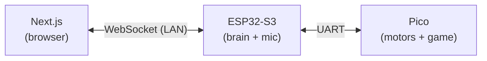

# UI ↔ ESP32-S3 ↔ Pico Integration — Design

## Goal

Let a Next.js chess UI drive (and stay in sync with) the physical board, while keeping the existing ESP32-S3 microphone input working. The ESP32-S3 is the brain: it accepts commands from both the UI and the mic, forwards canonical moves to the Pico, and relays the Pico's game-state feedback back up to the UI.

## Topology (LAN-only, no cloud)



- The laptop running `next dev` and the ESP32-S3 share the same Wi-Fi network.
- The ESP32-S3 runs a WebSocket server on its LAN IP, e.g. `ws://<s3-ip>/ws`.
- No remote server, no port forwarding, no auth (demo scope).
- Fallback option if venue Wi-Fi is hostile: run the S3 as a Wi-Fi Access Point ("ChessBot-AP") and have the laptop join it. Same protocol, different network plumbing.

## Source of truth

- **Game state lives on the Pico.** It already has `ChessGame` and a working move planner; we don't want two copies that can drift.
- The ESP32-S3 caches the last `STATE` message it saw from the Pico so it can hand it to a UI client that just connected. It is a relay + cache, not an authority.
- The UI waits for an `ACK` (or `ILLEGAL`) before animating a move. No optimistic UI for the demo — simpler and more honest about what the hardware actually did.

## Pico ↔ ESP32-S3: UART line protocol

Both sides at 115200 8N1 on the existing UART. Lines terminated with `\n`. Case-insensitive on the Pico side (it already uppercases input). Keep the protocol ASCII so it's debuggable with a serial monitor.

### S3 → Pico (commands)

| Line                    | Meaning                              |
|-------------------------|--------------------------------------|
| `MOVE:<from>:<to>`      | e.g. `MOVE:E2:E4`                    |
| `RESET`                 | reset the game                       |
| `STATE?`                | request a `STATE:` dump (for resync) |

### Pico → S3 (events)

| Line                          | Meaning                                                |
|-------------------------------|--------------------------------------------------------|
| `ACK:<from>:<to>`             | move accepted, motion starting                         |
| `ILLEGAL:<reason>`            | move rejected by `ChessGame` or planner                |
| `DONE:<from>:<to>`            | motors + magnet finished the move                      |
| `TURN:<WHITE\|BLACK>`         | turn changed (emitted after `DONE` and after `RESET`)  |
| `STATE:<compact-board>`       | full board snapshot; emitted on boot, `RESET`, `STATE?`|
| `LOG:<text>`                  | optional human-readable diagnostics                    |

The `STATE` payload format is TBD — simplest is 64 chars in row-major order using standard piece letters (`PNBRQK`/`pnbrqk`/`.`), plus a trailing turn marker, e.g. `STATE:rnbqkbnr/...whatever... w`. FEN is fine if it's cheap to emit; we don't need castling/en-passant rights for the demo unless the game logic enforces them.

### Pico-side changes

- Today's `main.cpp` reads `MOVE:<from>:<to>` from `Serial1`. Keep that.
- Wrap the existing `Serial.print*` debug output into a small helper so the *protocol* lines (`ACK`, `DONE`, `STATE`, …) go to `Serial1` and casual debug logs go to USB `Serial` only. Mixing them on one stream is fine for the demo but easier to parse if separated.
- Emit `ACK` immediately after `planner.startMove` succeeds, `DONE` after the planner loop finishes, `TURN` after the turn flips, and `STATE` on boot / after `RESET` / on `STATE?`.

## ESP32-S3 ↔ UI: WebSocket protocol

JSON messages over a single WebSocket. The S3 hosts it (e.g. `ESPAsyncWebServer` + `AsyncWebSocket`). One endpoint, all traffic.

### UI → S3

```json
{ "type": "move",  "from": "E2", "to": "E4" }
{ "type": "reset" }
{ "type": "hello" }    // optional; S3 replies with current state
```

### S3 → UI

```json
{ "type": "ack",     "from": "E2", "to": "E4" }
{ "type": "illegal", "from": "E2", "to": "E4", "reason": "..." }
{ "type": "done",    "from": "E2", "to": "E4" }
{ "type": "turn",    "color": "WHITE" }
{ "type": "state",   "board": "<compact-or-fen>", "turn": "WHITE" }
{ "type": "log",     "text": "..." }              // optional
```

The mapping S3 does is mechanical: parse the UART line, wrap it as JSON, broadcast to all connected WS clients. In the other direction: parse JSON, format the UART line, write to the Pico. The S3 also handles the mic path the same way — mic recognizer produces a `{from, to}` pair, S3 sends `MOVE:` down. Voice and UI commands are indistinguishable to the Pico, which is the point.

### Connection lifecycle

1. UI opens the WebSocket.
2. S3 immediately sends the cached `state` (and current `turn`) so the new client renders the right board without polling.
3. UI sends `move` / `reset`; S3 forwards to Pico.
4. Pico replies with `ack` → `done` → `turn`; S3 fans those out to *all* WS clients (so two browsers on the same LAN stay in sync, and the UI reflects voice-initiated moves the same way).

## ESP32-S3 internal shape

Three input sources, one output (UART to Pico):

- Mic recognizer task → produces `{from, to}` or `reset`.
- WebSocket handler → produces `{from, to}` or `reset` from JSON.
- UART reader → produces parsed events from the Pico.

A small dispatcher serializes commands going *down* (don't interleave a mic move and a UI move mid-line) and broadcasts events going *up*. While a move is in flight (between `ACK` and `DONE`), new commands should be queued or rejected — TBD which; rejection with an `illegal` reason of `"busy"` is the simpler choice.

State cached on the S3:
- Last `state` payload (string).
- Current `turn`.
- Whether a move is in flight.

## Next.js side

- A single client component opens the WebSocket to `NEXT_PUBLIC_S3_WS_URL` (e.g. `ws://192.168.1.42/ws`) and keeps it open for the page's lifetime. Reconnect with backoff on close.
- Board state is driven entirely by `state` / `done` / `turn` messages — the UI does not maintain its own authoritative game state.
- Clicking a piece + target square sends `{ "type": "move", from, to }`. The UI marks the move as "pending" until `ack`/`illegal` arrives, then animates on `done`.
- A "Reset" button sends `{ "type": "reset" }`.

No Node API routes, no `serialport`, no server-side code beyond what Next already does to serve the page. All hardware I/O is in the S3.

## Decisions (locked for the POC)

- **`STATE` payload**: 64 chars, row-major from rank 8 down to rank 1, piece letters (`PNBRQK` white, `pnbrqk` black, `.` empty), followed by a space and the side to move (`w`/`b`). Whatever is cheapest to emit from `ChessGame`.
- **Busy**: while a move is in flight (between `ACK` and `DONE`), any new command is rejected with `ILLEGAL:busy`. No queue.
- **Promotion**: out of scope for the POC.
- **Discovery**: S3's IP is hardcoded in the Next.js client for the demo. S3 also prints its IP over USB serial on boot for convenience.

## Build order (suggested)

1. Pico: extend the UART protocol with `ACK` / `DONE` / `TURN` / `STATE` / `STATE?` / `ILLEGAL`. Verify with a serial monitor by hand.
2. ESP32-S3: bring up Wi-Fi + WebSocket server, echo UART events as JSON, accept UI commands and forward as UART lines. Verify with a tiny HTML test page or `wscat`.
3. Integrate the mic recognizer into the same dispatcher.
4. Next.js: wire the WS client into the board UI; remove any local game-state simulation.
